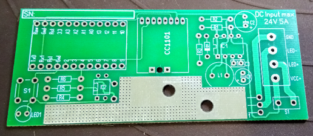

# HM-LC-Dim1PWM 12V-24V V2.1
## 1 Fach Dimmer 12V-24V, 5A

## benötigte Hardware
* S1	Kleinstsicherung kurz träge 5A RM5,08			1x
* C1	Elektrolytkondensator 10 uF/16V RM2,54			1x
* C2	Elektrolytkondensator 100 µF/35V RM3,5			1x
* IC1	MC34063A DIP-8						1x
* D1	1N5819							1x
* L1	Stehende-Induktivität, 07HCP, Ferrit, 220µF RM5		1x
* C3	Keramik kondensator 50 v 100pF				1x
* R1	1Ohm 1/4Watt						1x
* R2	3KOhm 1/4Watt						1x
* R3	1KOhm 1/4Watt						1x
* R4	4,7kOhm 1/4Watt						1x
* R5	100Ohm 1/4Watt						1x
* R6	470Ohm 1/4Watt						1x	
* LED1	5mm LED							1x
* IC2	LTV-817 DIP-4						1x
*	Taster 6*6						1x						
* V1	IRF3708 oder IRL2203N +Befestigung			1x
*	Arduino Pro Mini **ATmega328P (3.3V/8MHz)**		1x
*	CC1101 Funkmodul **(868 MHz)** + 2,0mm Stiftleiste	1x
*	Anschlussklemme, 4-pol, Ø 2 mm, RM 5,08			1x
* V2	KSD-01F Temperaturschalter 60°C  NC +Befestigung	1x

[Kontakt via Facebook](https://www.facebook.com/ronny.thomas.83)

[Software](https://github.com/pa-pa/AskSinPP/tree/master/examples/HM-LC-Dim1PWM-CV)

Bilder 

